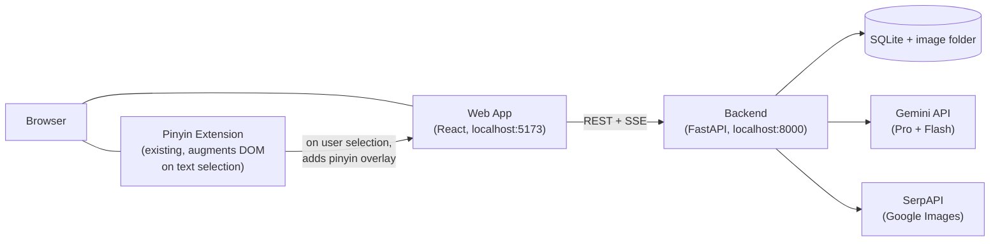
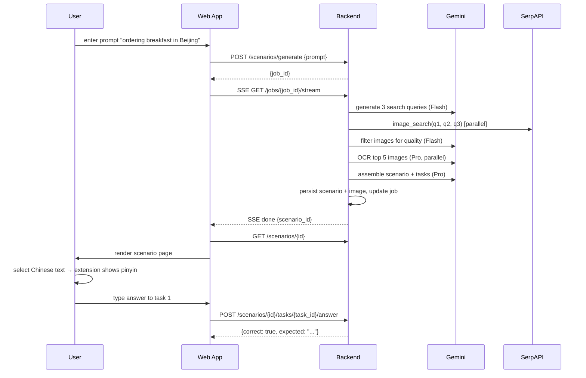
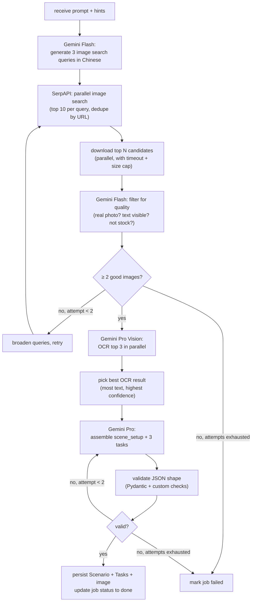

# Scenarios App — Design Doc

A separate web app that generates authentic real-world Chinese reading scenarios on demand and composes with the existing Pinyin Tool browser extension via the browser DOM.

---

## Table of Contents

1. [Purpose & Non-Goals](#1-purpose--non-goals)
2. [Architecture Overview](#2-architecture-overview)
3. [Tech Stack & Rationale](#3-tech-stack--rationale)
4. [Folder Structure](#4-folder-structure)
5. [Data Model](#5-data-model)
6. [API Contract](#6-api-contract)
7. [Agent Flow (Backend)](#7-agent-flow-backend)
8. [Frontend UX & Pages](#8-frontend-ux--pages)
9. [Composition With Extension](#9-composition-with-extension)
10. [Build Steps (Multi-Step LLM Build Plan)](#10-build-steps-multi-step-llm-build-plan)
11. [Testing Strategy (Cross-Cutting)](#11-testing-strategy-cross-cutting)
12. [Configuration & Secrets](#12-configuration--secrets)
13. [Open Questions Deferred Past v1](#13-open-questions-deferred-past-v1)

---

## 1. Purpose & Non-Goals

### What this app does

- Generates **authentic** Chinese reading scenarios on demand from a user prompt like "ordering breakfast in a Beijing 早餐店" or "navigating a Shanghai metro station".
- Sources real images from the open web (Google Images via SerpAPI), runs vision OCR on them, and assembles a scenario containing:
  - A short scene-setup paragraph in Chinese ("你刚走进...")
  - The raw extracted text (menu, signs, instructions) verbatim from the image
  - A small set of comprehension/action tasks ("which dish is cheapest?", "what time does the place close?")
- Persists scenarios so the user can revisit them, see history, and review past mistakes.
- Provides an interactive UI: prompt input, library, scenario reader with task answer flow.

### What this app explicitly does NOT do

- **Does not** add pinyin annotations, character-by-character translations, tap-to-define, or any reading aid. That is the existing Pinyin Tool extension's job. The app renders raw Chinese; the extension augments it on user selection.
- **Does not** filter or simplify content for HSK levels. Real menus and signs do not have a difficulty slider. Authenticity is the entire point.
- **Does not** run continuously. Generation happens on demand, triggered by the user.
- **Does not** require auth, cloud hosting, or multi-user support in v1. Local-only.
- **Does not** modify the extension. Composition is via shared DOM behavior, not direct integration.
- **Does not** maintain a curated graded library. It produces real, sometimes messy, content.

### Composition principle

Three loosely-coupled systems, each owning one slice of responsibility:

| System | Owns |
|---|---|
| **Backend** (FastAPI) | Agent loop, image search, vision OCR, scenario assembly, persistence, REST API |
| **Web app** (React) | UI: library, generate, scenario reader, history; task interaction; rendering raw Chinese in plain DOM |
| **Pinyin Tool extension** (existing, unchanged) | Pinyin overlay, definitions, vocab tracking — triggered by user text selection on any page including the scenarios app |

The app does NOT know the extension exists. The extension does NOT know the app exists. They co-exist in the browser; the user benefits from both.

---

## 2. Architecture Overview



### Why each piece is separate

- **Backend separate from extension.** The extension runs in a Manifest V3 service worker, which Chrome suspends after ~30 seconds of idle. Generation involves long-running orchestration (image search, parallel OCR, multiple LLM calls) and direct file system access for caching images — all painful or impossible from a service worker. A regular Python process handles this cleanly.
- **Web app separate from extension.** Modern frontend tooling (Vite HMR, React DevTools, route-based code) gives a far better UX than Chrome extension hub pages. Decoupling means the extension stays a focused, lightweight tool and can ship/upgrade independently.
- **Extension untouched.** The existing extension already does its job (pinyin overlay on selected Chinese text on any URL). It will work on the scenarios app's pages out of the box because the manifest matches `<all_urls>`. No changes needed in v1.

### Request lifecycle (happy path)



---

## 3. Tech Stack & Rationale

### Backend

| Tool | Version | Why |
|---|---|---|
| Python | 3.11+ | Best LLM/agent ecosystem; mature async |
| FastAPI | 0.115+ | Async-first, automatic OpenAPI, Pydantic validation, easy SSE |
| uvicorn | latest | Standard ASGI server for FastAPI |
| SQLAlchemy | 2.x | Mature ORM with async support; future-proofs migration off SQLite |
| Alembic | latest | Schema migrations from day one prevents pain later |
| aiosqlite | latest | Async SQLite driver for SQLAlchemy |
| httpx | latest | Async HTTP client for SerpAPI + image downloads |
| google-genai | latest | Official Gemini SDK (vision + text); same provider the extension uses, so a single Google API key powers both |
| Pillow | latest | Image validation, resizing before vision calls |
| pydantic-settings | latest | `.env` config with type validation |
| python-multipart | latest | FastAPI file upload support (future) |
| pytest | latest | Test runner |
| pytest-asyncio | latest | Async test support |
| pytest-httpx | latest | Mock httpx for deterministic tests |
| ruff | latest | Lint + format (replaces black + flake8 + isort) |

### Frontend

| Tool | Version | Why |
|---|---|---|
| React | 18 | Most popular, best ecosystem, user requested |
| TypeScript | 5+ | Type safety; matches the existing extension's language |
| Vite | 6+ | Fast HMR, ESM-native, matches the extension's bundler |
| React Router | 6+ | Standard SPA routing |
| TanStack Query | 5+ | Server-state caching, polling, retry — perfect for job polling |
| Tailwind CSS | 3+ | Fast styling without naming things |
| Zod | 3+ | Runtime validation of API responses (paranoid but cheap) |
| Vitest | latest | Fast, Vite-native test runner |
| @testing-library/react | latest | Standard component testing |
| @testing-library/user-event | latest | Realistic user interaction simulation |
| MSW | 2+ | Mock service worker for API mocking in tests |

### External services

| Service | Purpose | Cost notes |
|---|---|---|
| Google Gemini 2.5 Pro | Vision OCR, scenario assembly | Highest quality; default for the heavy steps |
| Google Gemini 2.5 Flash | Search-query generation, image quality filter | Cheap and fast; suitable for simple judgment calls |
| Google Gemini 2.5 Flash Lite | Optional fallback for the cheapest filtering paths | Lowest cost tier; available but not required |
| SerpAPI | Google Images search | Free tier: 100/mo; paid: $50/mo for 5k |

Gemini API key reuse: the existing browser extension already supports Gemini via `PROVIDER_PRESETS` in `src/shared/constants.ts`. The same Google API key the user pastes into the extension's settings can be reused as the backend's `GEMINI_API_KEY`. One key powers both tools.

A typical scenario generation costs a few cents all-in, dominated by Pro vision calls. Costs vary with current Google pricing; benchmark by running a few live generations and inspecting the dashboard.

---

## 4. Folder Structure

Final intended layout of `scenarios-app/` after all build steps complete:

```
scenarios-app/
├── DESIGN.md                          # this file
├── README.md                          # quick-start: how to run locally
├── .gitignore
├── backend/
│   ├── pyproject.toml                 # deps + ruff + pytest config
│   ├── .env.example
│   ├── alembic.ini
│   ├── alembic/
│   │   ├── env.py
│   │   └── versions/
│   ├── app/
│   │   ├── __init__.py
│   │   ├── main.py                    # FastAPI app, CORS, route registration
│   │   ├── core/
│   │   │   ├── __init__.py
│   │   │   ├── config.py              # Settings via pydantic-settings
│   │   │   └── prompts.py             # All LLM prompt templates as constants
│   │   ├── db/
│   │   │   ├── __init__.py
│   │   │   ├── base.py                # SQLAlchemy Base
│   │   │   ├── session.py             # async engine + sessionmaker
│   │   │   └── models.py              # Scenario, Task, Attempt, GenerationJob
│   │   ├── schemas/
│   │   │   ├── __init__.py
│   │   │   ├── scenario.py            # Pydantic request/response models
│   │   │   ├── task.py
│   │   │   └── job.py
│   │   ├── agent/
│   │   │   ├── __init__.py
│   │   │   ├── search.py              # SerpAPI client
│   │   │   ├── vision.py              # Gemini Vision OCR
│   │   │   ├── filter.py              # Gemini Flash image quality filter
│   │   │   ├── assembly.py            # Scenario + task generation
│   │   │   ├── orchestrator.py        # Wires everything together with retries
│   │   │   └── types.py               # ImageResult, OcrResult, ScenarioDraft
│   │   ├── api/
│   │   │   ├── __init__.py
│   │   │   ├── deps.py                # Common deps (db session, settings)
│   │   │   ├── scenarios.py           # /scenarios routes
│   │   │   ├── jobs.py                # /jobs routes (incl. SSE)
│   │   │   ├── tasks.py               # /tasks/answer route
│   │   │   ├── history.py             # /history route
│   │   │   └── images.py              # GET /scenarios/{id}/image
│   │   └── services/
│   │       ├── __init__.py
│   │       ├── job_runner.py          # Background task launcher
│   │       └── image_store.py         # Save/load images on disk
│   ├── data/                          # gitignored
│   │   ├── scenarios.db
│   │   └── images/
│   └── tests/
│       ├── __init__.py
│       ├── conftest.py                # Fixtures: app, db, client
│       ├── fixtures/
│       │   ├── images/                # Hand-curated real photos
│       │   │   ├── menu_001.jpg
│       │   │   ├── menu_001_expected.json
│       │   │   ├── sign_001.jpg
│       │   │   └── ... (5-10 total)
│       │   └── api_responses/         # Recorded SerpAPI/Gemini responses
│       ├── unit/
│       │   ├── test_search.py
│       │   ├── test_vision.py
│       │   ├── test_filter.py
│       │   ├── test_assembly.py
│       │   └── test_orchestrator.py
│       ├── integration/
│       │   ├── test_api_scenarios.py
│       │   ├── test_api_jobs.py
│       │   └── test_api_tasks.py
│       └── live/
│           ├── test_search_live.py    # env-gated, hits real SerpAPI
│           ├── test_vision_live.py    # env-gated, hits real Gemini
│           └── test_e2e_live.py       # full real-world generation
└── frontend/
    ├── package.json
    ├── tsconfig.json
    ├── vite.config.ts
    ├── tailwind.config.js
    ├── postcss.config.js
    ├── index.html
    ├── src/
    │   ├── main.tsx                   # React root + providers
    │   ├── App.tsx                    # Router setup
    │   ├── api/
    │   │   ├── client.ts              # fetch wrapper with base URL
    │   │   ├── scenarios.ts           # Typed API methods
    │   │   ├── jobs.ts
    │   │   └── schemas.ts             # Zod schemas mirroring backend
    │   ├── hooks/
    │   │   ├── useScenarios.ts        # TanStack Query hooks
    │   │   ├── useScenario.ts
    │   │   ├── useGenerateScenario.ts
    │   │   └── useJob.ts              # Polls or SSE-subscribes
    │   ├── pages/
    │   │   ├── LibraryPage.tsx
    │   │   ├── GeneratePage.tsx
    │   │   ├── ScenarioPage.tsx
    │   │   └── HistoryPage.tsx
    │   ├── components/
    │   │   ├── Layout.tsx
    │   │   ├── Nav.tsx
    │   │   ├── ScenarioCard.tsx
    │   │   ├── TaskItem.tsx
    │   │   ├── RawContent.tsx         # Renders raw Chinese in plain DOM
    │   │   ├── GenerationStatus.tsx
    │   │   └── ErrorBanner.tsx
    │   └── styles/
    │       └── index.css              # Tailwind directives
    └── tests/
        ├── setup.ts
        ├── pages/
        │   ├── LibraryPage.test.tsx
        │   ├── GeneratePage.test.tsx
        │   ├── ScenarioPage.test.tsx
        │   └── HistoryPage.test.tsx
        ├── components/
        │   ├── ScenarioCard.test.tsx
        │   ├── TaskItem.test.tsx
        │   ├── RawContent.test.tsx
        │   └── GenerationStatus.test.tsx
        └── api/
            └── client.test.ts
```

---

## 5. Data Model

### SQLAlchemy models

```python
class Scenario(Base):
    __tablename__ = "scenarios"
    id: Mapped[str] = mapped_column(String(32), primary_key=True)  # uuid4 hex
    request_prompt: Mapped[str] = mapped_column(Text)              # what the user asked for
    scene_type: Mapped[str] = mapped_column(String(32))            # menu/sign/notice/...
    scene_setup: Mapped[str] = mapped_column(Text)                 # Chinese setup paragraph
    raw_content: Mapped[str] = mapped_column(Text)                 # the OCR'd text, verbatim
    source_image_path: Mapped[Optional[str]] = mapped_column(String(255))
    source_url: Mapped[Optional[str]] = mapped_column(Text)
    search_query: Mapped[Optional[str]] = mapped_column(Text)
    created_at: Mapped[datetime] = mapped_column(DateTime, default=datetime.utcnow)
    tasks: Mapped[list["Task"]] = relationship(back_populates="scenario", cascade="all, delete-orphan")

class Task(Base):
    __tablename__ = "tasks"
    id: Mapped[str] = mapped_column(String(32), primary_key=True)
    scenario_id: Mapped[str] = mapped_column(ForeignKey("scenarios.id"))
    position_index: Mapped[int] = mapped_column(Integer)
    prompt: Mapped[str] = mapped_column(Text)                      # in English or Chinese
    answer_type: Mapped[str] = mapped_column(String(16))           # exact | numeric | multi
    expected_answer: Mapped[str] = mapped_column(Text)             # canonical answer
    acceptable_answers: Mapped[Optional[str]] = mapped_column(Text)  # JSON list of equivalents
    explanation: Mapped[Optional[str]] = mapped_column(Text)       # shown after answering
    scenario: Mapped[Scenario] = relationship(back_populates="tasks")
    attempts: Mapped[list["Attempt"]] = relationship(back_populates="task", cascade="all, delete-orphan")

class Attempt(Base):
    __tablename__ = "attempts"
    id: Mapped[int] = mapped_column(Integer, primary_key=True, autoincrement=True)
    task_id: Mapped[str] = mapped_column(ForeignKey("tasks.id"))
    user_answer: Mapped[str] = mapped_column(Text)
    is_correct: Mapped[bool] = mapped_column(Boolean)
    attempted_at: Mapped[datetime] = mapped_column(DateTime, default=datetime.utcnow)
    task: Mapped[Task] = relationship(back_populates="attempts")

class GenerationJob(Base):
    __tablename__ = "generation_jobs"
    id: Mapped[str] = mapped_column(String(32), primary_key=True)
    request_prompt: Mapped[str] = mapped_column(Text)
    status: Mapped[str] = mapped_column(String(16))  # pending | running | done | failed
    progress_stage: Mapped[Optional[str]] = mapped_column(String(64))  # human-readable
    error_message: Mapped[Optional[str]] = mapped_column(Text)
    scenario_id: Mapped[Optional[str]] = mapped_column(ForeignKey("scenarios.id"))
    created_at: Mapped[datetime] = mapped_column(DateTime, default=datetime.utcnow)
    completed_at: Mapped[Optional[datetime]] = mapped_column(DateTime)
```

### JSON shapes returned by API

`ScenarioOut`:
```json
{
  "id": "ab12...",
  "request_prompt": "ordering breakfast in Beijing",
  "scene_type": "menu",
  "scene_setup": "你刚走进一家老北京早餐店,服务员把菜单递给你...",
  "raw_content": "豆浆  3元\n油条  2元\n包子(肉)  4元\n...",
  "source_image_url": "/scenarios/ab12.../image",
  "source_url": "https://...",
  "created_at": "2026-04-18T10:23:00Z",
  "tasks": [
    {
      "id": "ts01...",
      "position_index": 0,
      "prompt": "What is the cheapest item on the menu?",
      "answer_type": "exact",
      "explanation": null
    }
  ]
}
```

`AnswerResult`:
```json
{
  "correct": true,
  "expected_answer": "油条",
  "acceptable_answers": ["油条", "youtiao"],
  "explanation": "油条 (yóutiáo) is 2元, the cheapest. 豆浆 is 3元, 包子 is 4元."
}
```

`JobStatus`:
```json
{
  "id": "jb01...",
  "status": "running",
  "progress_stage": "ocr_in_progress",
  "scenario_id": null,
  "error_message": null
}
```

---

## 6. API Contract

Base URL: `http://localhost:8000`. CORS allows `http://localhost:5173`.

### POST `/scenarios/generate`

Start a generation job.

Request body:
```json
{
  "prompt": "ordering breakfast in a Beijing 早餐店",
  "scene_hint": "menu",          // optional: menu | sign | notice | map | label | any
  "region": "Beijing",            // optional: free-form
  "format_hint": "handwritten"    // optional: handwritten | printed | digital | any
}
```

Response: `202 Accepted`
```json
{ "job_id": "jb01..." }
```

### GET `/jobs/{job_id}`

Poll a job's status.

Response: `200 OK` — `JobStatus`

### GET `/jobs/{job_id}/stream`

Server-Sent Events stream of job progress. Emits one event per stage transition; terminal events are `done` (with `scenario_id`) or `failed` (with `error_message`).

Stream events:
```
event: progress
data: {"stage": "search_queries_generated", "detail": "3 queries"}

event: progress
data: {"stage": "images_searched", "detail": "12 candidates"}

event: progress
data: {"stage": "images_filtered", "detail": "5 selected"}

event: progress
data: {"stage": "ocr_in_progress"}

event: progress
data: {"stage": "assembling"}

event: done
data: {"scenario_id": "ab12..."}
```

### GET `/scenarios`

List scenarios.

Query params: `limit` (default 20, max 100), `cursor` (opaque), `scene_type` (filter)

Response:
```json
{
  "items": [ /* ScenarioSummary objects */ ],
  "next_cursor": "..."
}
```

`ScenarioSummary` is `ScenarioOut` minus `raw_content` and `tasks` (lightweight for grids).

### GET `/scenarios/{id}`

Full scenario including tasks.

Response: `200 OK` — `ScenarioOut`

### POST `/scenarios/{id}/tasks/{task_id}/answer`

Submit an answer.

Request:
```json
{ "answer": "油条" }
```

Response: `200 OK` — `AnswerResult`

Side effect: persists an `Attempt` row.

### GET `/scenarios/{id}/image`

Serves the source image file with appropriate `Content-Type` and `Cache-Control: max-age=31536000, immutable`.

### GET `/history`

Recent attempts across all scenarios.

Query params: `limit`, `cursor`, `correct_only` (bool), `incorrect_only` (bool)

Response:
```json
{
  "items": [
    {
      "attempt_id": 123,
      "task_id": "ts01...",
      "scenario_id": "ab12...",
      "scenario_title": "ordering breakfast in Beijing",
      "task_prompt": "What is the cheapest item?",
      "user_answer": "包子",
      "expected_answer": "油条",
      "is_correct": false,
      "attempted_at": "2026-04-18T10:24:00Z"
    }
  ],
  "next_cursor": "..."
}
```

### Error responses

All errors follow:
```json
{ "detail": "human-readable message", "code": "machine_readable_code" }
```

Standard codes: `not_found`, `invalid_request`, `agent_failed`, `external_service_error`, `rate_limited`.

---

## 7. Agent Flow (Backend)

### Pipeline diagram



### Module contracts

```python
# agent/types.py
@dataclass
class ImageResult:
    url: str
    title: Optional[str]
    source_page_url: Optional[str]
    width: Optional[int]
    height: Optional[int]

@dataclass
class DownloadedImage:
    bytes_: bytes
    mime: str
    original: ImageResult

@dataclass
class FilterVerdict:
    image: DownloadedImage
    keep: bool
    reason: str

@dataclass
class OcrResult:
    image: DownloadedImage
    raw_text: str
    confidence: float       # heuristic 0-1, LLM self-reported
    scene_type_guess: str
    notes: Optional[str]

@dataclass
class ScenarioDraft:
    scene_type: str
    scene_setup: str
    raw_content: str
    tasks: list["TaskDraft"]
    source_image: DownloadedImage

@dataclass
class TaskDraft:
    prompt: str
    answer_type: str
    expected_answer: str
    acceptable_answers: list[str]
    explanation: Optional[str]
```

### Gemini calling conventions

All LLM calls go through a thin wrapper in `app/agent/_gemini.py` that owns the `google.genai.Client`. Conventions:

- One shared `genai.Client(api_key=settings.GEMINI_API_KEY)` instance, reused across calls.
- All structured prompts use `response_mime_type="application/json"` plus a `response_schema` (Pydantic-model-derived) so Gemini returns parseable JSON without prose wrappers.
- Vision inputs use `types.Part.from_bytes(data=image_bytes, mime_type=image.mime)` rather than file uploads.
- Per-call timeout enforced via `asyncio.wait_for`; SDK does not expose a per-request timeout for all transports.
- Generation config: `temperature=0.2` for OCR (deterministic), `temperature=0.7` for assembly (some variety in scene_setup), `temperature=0` for filter (binary decision).
- Errors surfaced as `GeminiError(code, message)` mapped from `google.genai.errors.*` exception types so callers don't depend on the SDK's exception hierarchy directly.

### Prompts

All prompts live in `app/core/prompts.py` as module-level constants for easy iteration. They are model-agnostic in tone but rely on Gemini's JSON-mode + response_schema to enforce shape.

**Search query generation** (Gemini Flash, `gemini-2.5-flash`):
```
You help a learner of Mandarin Chinese find authentic real-world reading
material. Given a scenario prompt, output 3 Chinese-language Google Images
search queries that would surface real, in-the-wild photos of relevant
signs, menus, or notices.

Constraints:
- Each query must be in Simplified Chinese
- Each query must include the word 实拍 (real photo) or similar to bias
  toward user-uploaded photos rather than stock imagery
- Vary the queries: one specific, one general, one with regional flavor
  if the prompt names a region
- Output JSON: {"queries": ["q1", "q2", "q3"]}

Scenario prompt: {prompt}
Scene hint: {scene_hint}
Region: {region}
```

**Image quality filter** (Gemini Flash, `gemini-2.5-flash`, vision):
```
You are filtering candidate images for a Chinese learning app. Look at
this image and decide if it should be kept.

Keep if ALL of:
- Real photo (not stock, not illustration, not screenshot of text editor)
- Contains visible Chinese text that a learner could read
- Text is legible (not blurred, not too small, not heavily obscured)
- Authentic context (a real menu, sign, label, etc., not a translation
  exercise, textbook page, or quiz)

Output JSON: {"keep": bool, "reason": "<one short sentence>"}
```

**Vision OCR** (Gemini Pro, `gemini-2.5-pro`):
```
You are looking at a real-world photo from China taken by a regular person.
Extract ALL visible Chinese text exactly as shown. Preserve:
- Original character forms (do NOT convert traditional <-> simplified)
- Original line breaks and spatial layout when meaningful (e.g., one
  menu item per line)
- Numbers and prices in the form they appear (元, ¥, RMB, plain digits)
- Any accompanying English / pinyin if present, in its original position

Do NOT:
- Translate
- Add pinyin
- Add interpretation
- Filter or "clean up" colloquialisms / regional terms / abbreviations

Output JSON:
{
  "raw_text": "<the extracted text, with newlines as \\n>",
  "confidence": <float 0-1, your self-assessment of OCR accuracy>,
  "scene_type": "menu" | "sign" | "notice" | "map" | "label" | "instruction" | "other",
  "notes": "<optional: anything unusual, e.g. handwritten, partly obscured>"
}
```

**Scenario assembly** (Gemini Pro, `gemini-2.5-pro`):
```
You are building a reading-comprehension scenario for a Mandarin Chinese
learner from a real-world image's extracted text.

Inputs:
- USER_REQUEST: what the learner asked for
- SCENE_TYPE: kind of source (menu, sign, etc.)
- RAW_TEXT: the verbatim extracted Chinese text — DO NOT MODIFY THIS

Build:
1. scene_setup: ONE short paragraph (2-4 sentences) in natural Mandarin,
   second person, placing the learner in this scene. Example:
   "你刚走进一家老北京早餐店,坐下后服务员递给你菜单。你想点一份豆浆和油条..."
   - Use the raw text's vocabulary where possible
   - Don't add information not supported by the raw text

2. tasks: EXACTLY 3 comprehension tasks based ONLY on what's in raw_text.
   Each task must have a definite, verifiable answer derivable from the
   text alone. No interpretation tasks.
   - Mix task types: one "find" task, one "calculate/compare" task, one
     "comprehension" task
   - prompt: in ENGLISH (so the learner knows what to do without already
     understanding Chinese)
   - answer_type: "exact" (string match), "numeric" (number), or "multi"
     (multiple correct answers)
   - expected_answer: canonical correct answer
   - acceptable_answers: list of equivalent answers, e.g. ["油条",
     "youtiao", "Youtiao"] for transliteration tolerance. Always include
     the exact Chinese form.
   - explanation: 1-2 sentences in English explaining why, with reference
     to specific text from raw_text

Constraints:
- DO NOT alter raw_text in any way; it will be passed through verbatim
- DO NOT add pinyin, definitions, or translations of raw_text
- If raw_text doesn't support 3 verifiable tasks, output fewer; the
  validator will retry with a different image

Output JSON:
{
  "scene_setup": "...",
  "tasks": [
    {
      "prompt": "...",
      "answer_type": "exact|numeric|multi",
      "expected_answer": "...",
      "acceptable_answers": ["...", "..."],
      "explanation": "..."
    }
  ]
}
```

### Concurrency, retries, timeouts

- Image search and downloads use `asyncio.gather` with a max concurrency of 5 via `asyncio.Semaphore`.
- Vision OCR runs on top 3 filtered images in parallel, max concurrency 3.
- Each external call has a per-request timeout (search: 10s, download: 8s, vision: 60s, assembly: 30s).
- Retry policy: filter step retries query broadening once; assembly step retries with the next-best image once. Beyond that, fail the job.
- The orchestrator emits progress events at each stage transition for SSE consumers.

---

## 8. Frontend UX & Pages

### Global layout

- Top nav: app title (left), tabs (Library, Generate, History)
- Main content area below nav, max-width container
- Footer note: "Pinyin and translations are provided by the Pinyin Tool extension. Select any Chinese text to see them."

### Library page (`/`)

```
[Library]                                    [+ New Scenario]
[Filter: All | Menu | Sign | Notice | ...]   [Sort: Recent | A-Z]

┌──────────────┐  ┌──────────────┐  ┌──────────────┐
│ [thumb]      │  │ [thumb]      │  │ [thumb]      │
│ menu         │  │ sign         │  │ menu         │
│ Beijing      │  │ Shanghai     │  │ Chongqing    │
│ 早餐店       │  │ 地铁站        │  │ 火锅店        │
│ 3 tasks      │  │ 2 tasks      │  │ 5 tasks      │
│ 2d ago       │  │ 5d ago       │  │ 1w ago       │
└──────────────┘  └──────────────┘  └──────────────┘
```

- Cards link to `/scenarios/:id`.
- Empty state: "No scenarios yet. [Generate your first one]" CTA.
- Loading state: skeleton cards.
- Error state: inline banner with retry.

### Generate page (`/generate`)

```
[Generate a scenario]

What do you want to read?
┌────────────────────────────────────────────────────┐
│ ordering breakfast at a Beijing 早餐店             │
└────────────────────────────────────────────────────┘

Optional details:
  Scene type: [Any ▼]   Region: [____________]   Format: [Any ▼]

[Generate]

While generating:
  ┌────────────────────────────────────────────┐
  │ ✓ Generated search queries (1.2s)          │
  │ ✓ Found 12 candidate images (3.4s)         │
  │ ✓ Filtered to 5 quality images (2.1s)      │
  │ ⏳ Reading text from images...              │
  │   Estimated time remaining: ~20s           │
  └────────────────────────────────────────────┘
```

- On success: redirect to `/scenarios/:id`.
- On failure: show error with the failure reason and a "Try again" button.

### Scenario page (`/scenarios/:id`)

Three-column layout (responsive: stacks on mobile):

```
┌─────────────┐  ┌──────────────────┐  ┌──────────────────┐
│             │  │ [Setting]         │  │ [Tasks]          │
│  [Image]    │  │ 你刚走进...       │  │                  │
│             │  │                   │  │ 1. What is the   │
│             │  │ ──────────────    │  │    cheapest      │
│             │  │ [Source Text]    │  │    item?         │
│             │  │                   │  │    [_________]   │
│             │  │ 豆浆  3元         │  │    [Submit]      │
│             │  │ 油条  2元         │  │                  │
│             │  │ 包子(肉) 4元      │  │ 2. ...           │
│             │  │ ...               │  │                  │
│             │  │                   │  │ 3. ...           │
└─────────────┘  └──────────────────┘  └──────────────────┘
                                        [Score: 0/3]
```

- Source Text and Setting are rendered as plain text in `<p>` / `<pre>` elements with a `data-scenario-content="true"` attribute (for the extension to optionally style differently in future).
- Tasks: input field per task, Submit button. After submit:
  - Correct: green check, show explanation expandable
  - Wrong: red X, show "Expected: X", show explanation expanded
  - All three answered: footer shows summary, "Try another scenario" CTA.
- Image: clickable to open full-size in modal.
- Re-attempt: tasks can be re-attempted, but only the first attempt counts toward history score.

### History page (`/history`)

```
[History]
[Filter: All | Correct | Incorrect]

┌────────────────────────────────────────────────────────┐
│ 2026-04-18  ❌  ordering breakfast > task 1            │
│              "What is the cheapest item?"              │
│              You: 包子   Expected: 油条                │
│              [Review scenario]                         │
├────────────────────────────────────────────────────────┤
│ 2026-04-18  ✓   ordering breakfast > task 2            │
│              "How much for 豆浆 and 油条 together?"   │
│              You: 5元   Expected: 5元                  │
└────────────────────────────────────────────────────────┘
```

### What we explicitly do NOT render

- No pinyin under any character. Ever. The extension provides this on selection.
- No tap-to-translate buttons. The extension provides this.
- No vocabulary panel. The extension's vocab store handles tracking.
- No character-by-character breakdown.
- No HSK level badges.
- No "click for definition".

The app's job is to put authentic Chinese in front of the user and ask them to do something with it. The extension's job is to provide help when they get stuck.

---

## 9. Composition With Extension

### How the existing extension actually works

From `manifest.json` and `src/content/content.ts`:

- Manifest matches `<all_urls>` so the content script is injected into the scenarios app's pages without any configuration.
- The extension is **selection-driven**, not passive: the user must select Chinese text (or use the right-click menu, or hit `Alt+Shift+P`) to trigger the pinyin overlay. It does not paint pinyin over the entire page.
- The trigger is `mouseup` on the page → `containsChinese()` check → pinyin request → overlay.
- The overlay is positioned absolutely near the selection.

### Implications for the scenarios app

1. **Render raw Chinese in plain selectable text.** Use `<p>`, `<pre>`, `<span>` — anything that supports normal text selection. Avoid:
   - `contenteditable="true"` — interferes with selection events
   - SVG `<text>` — extension may not detect it
   - Non-text elements (images of text) for the raw_content
   - CSS `user-select: none` on raw_content
2. **Don't intercept `mouseup`** on raw content nodes. The extension listens on `document` so a `stopPropagation` on an ancestor would break it.
3. **Don't reuse the overlay's CSS selectors.** The extension's overlay uses CSS classes from `src/content/overlay.css`. The scenarios app should use clearly distinct class names (Tailwind utilities + scoped names like `scenario-*`) to avoid visual collisions.
4. **Image of source.** The extension also has `startOCRSelection` — the user could in principle drag a region on the source image and the extension would OCR it. This is a nice bonus but not required.
5. **Localhost origin.** The content script runs on `http://localhost:5173` because of `<all_urls>`. No special permission needed.

### Verification checklist (from build step 12)

- Open `http://localhost:5173/scenarios/<id>` with the extension installed and enabled.
- Select 3 Chinese characters from `raw_content`. Confirm overlay appears with pinyin.
- Select 3 Chinese characters from `scene_setup`. Confirm overlay appears.
- Right-click selection. Confirm context menu entry works.
- Press `Alt+Shift+P` after selecting. Confirm shortcut works.
- Select Chinese inside a task `prompt`. (Tasks may be in English; if Chinese is present the overlay should still work.)
- Open scenario page in incognito without the extension. Confirm the app still works (no JS errors), just without pinyin.

### Future bridge (out of scope for v1)

Optional future integration to push scenario vocabulary into the extension's vocab store. Would require:
- Extension to expose a `chrome.runtime.sendMessage` listener for external pages (requires `externally_connectable` in manifest).
- App to detect extension presence and offer "Add all words to vocab" button.
- Out of scope. Document only.

---

## 10. Build Steps (Multi-Step LLM Build Plan)

Each step below is a self-contained chunk. A fresh LLM session can pick up any single step, follow the spec, and produce something testable. Steps are ordered so each one's tests can run against the artifacts of all previous steps.

For every step:
- **Goal**: one sentence of intent
- **Files**: paths created or modified
- **Implementation notes**: concrete decisions, libraries, gotchas
- **Tests to write**: named tests + what they assert
- **Manual verification**: explicit steps a human should run
- **Definition of done**: checklist that must all be true

---

### Step 1 — Backend skeleton + data model

**Goal.** Stand up the FastAPI app and SQLAlchemy models with a working test harness.

**Files.**
- `scenarios-app/backend/pyproject.toml`
- `scenarios-app/backend/.env.example`
- `scenarios-app/backend/alembic.ini`
- `scenarios-app/backend/alembic/env.py`
- `scenarios-app/backend/alembic/versions/0001_initial.py`
- `scenarios-app/backend/app/__init__.py`
- `scenarios-app/backend/app/main.py`
- `scenarios-app/backend/app/core/config.py`
- `scenarios-app/backend/app/db/base.py`
- `scenarios-app/backend/app/db/session.py`
- `scenarios-app/backend/app/db/models.py`
- `scenarios-app/backend/tests/conftest.py`
- `scenarios-app/backend/tests/unit/test_models.py`
- `scenarios-app/backend/tests/integration/test_app_smoke.py`
- `scenarios-app/.gitignore`

**Implementation notes.**
- Use `pydantic-settings` `BaseSettings` for `Settings` (DATABASE_URL, IMAGE_STORAGE_DIR, GEMINI_API_KEY, SERPAPI_KEY, ALLOWED_ORIGINS).
- DB session: async engine via `create_async_engine("sqlite+aiosqlite:///./data/scenarios.db")`.
- Alembic configured to use the same URL via `alembic/env.py` reading from settings.
- `main.py` exposes `GET /healthz` returning `{"status": "ok"}`.
- CORS middleware enabled with origins from settings.
- `conftest.py` provides:
  - `app` fixture: a fresh FastAPI app with an in-memory SQLite DB
  - `db_session` fixture: yields an `AsyncSession`
  - `client` fixture: `httpx.AsyncClient` wired to the app via `ASGITransport`

**Tests to write.**
- `test_models.py::test_scenario_create_and_query` — insert a Scenario with two Tasks, query back, assert relationship loaded.
- `test_models.py::test_attempt_cascade_delete` — delete a Task, assert its Attempts deleted.
- `test_models.py::test_generation_job_default_status` — create a GenerationJob, assert `status == "pending"` by default if unset.
- `test_app_smoke.py::test_healthz` — GET `/healthz` returns 200 with `{"status": "ok"}`.
- `test_app_smoke.py::test_cors_preflight` — OPTIONS request from `http://localhost:5173` returns 200 with appropriate `Access-Control-Allow-Origin`.

**Manual verification.**
- `cd scenarios-app/backend && uv pip install -e .` (or pip)
- `alembic upgrade head` creates the SQLite file
- `uvicorn app.main:app --reload` starts on port 8000
- `curl http://localhost:8000/healthz` returns `{"status":"ok"}`
- `curl http://localhost:8000/docs` shows Swagger UI

**Definition of done.**
- [ ] All 5 tests pass via `pytest`
- [ ] `ruff check .` passes
- [ ] App boots without errors
- [ ] Migrations create all 4 tables; `sqlite3 data/scenarios.db ".schema"` shows expected columns
- [ ] `.gitignore` excludes `data/`, `.env`, `__pycache__/`, `.venv/`

---

### Step 2 — Image search module

**Goal.** Pure async function `search_images(query, limit) -> list[ImageResult]` backed by SerpAPI.

**Files.**
- `scenarios-app/backend/app/agent/__init__.py`
- `scenarios-app/backend/app/agent/types.py`
- `scenarios-app/backend/app/agent/search.py`
- `scenarios-app/backend/tests/unit/test_search.py`
- `scenarios-app/backend/tests/live/test_search_live.py`
- `scenarios-app/backend/tests/fixtures/api_responses/serpapi_breakfast_beijing.json`

**Implementation notes.**
- Use `httpx.AsyncClient` with a 10-second timeout.
- SerpAPI endpoint: `https://serpapi.com/search.json` with `engine=google_images`, `q=<query>`, `api_key=<key>`, `num=<limit>`, `ijn=0`.
- Parse the `images_results` array. Map each entry to `ImageResult` taking `original`, `title`, `source`, `original_width`, `original_height`.
- Filter out results without an `original` URL or where `original` is a data: URI.
- Function signature:
  ```python
  async def search_images(
      query: str,
      *,
      limit: int = 10,
      client: httpx.AsyncClient | None = None,
      settings: Settings | None = None,
  ) -> list[ImageResult]
  ```
- Fail loud on HTTP non-200 by raising `SearchError(detail, status_code)`.

**Tests to write.**
- `test_search.py::test_parses_serpapi_response` — feed the recorded JSON fixture via `pytest-httpx`, assert 10 `ImageResult`s parsed correctly.
- `test_search.py::test_filters_data_uri_results` — fixture with one data: URI, assert it's excluded.
- `test_search.py::test_respects_limit` — fixture with 30 results, request limit=5, assert returns 5.
- `test_search.py::test_raises_on_500` — mock 500 response, assert `SearchError` raised.
- `test_search.py::test_raises_on_missing_api_key` — settings with empty SERPAPI_KEY, assert configuration error before HTTP call.
- `test_search_live.py::test_real_query` — env-gated by `RUN_LIVE_TESTS=1`. Performs real query for `北京 早餐 实拍 菜单`, asserts >= 5 results returned.

**Manual verification.**
- With `SERPAPI_KEY` set: `python -c "import asyncio; from app.agent.search import search_images; print(asyncio.run(search_images('北京早餐 实拍 菜单')))"` prints results.

**Definition of done.**
- [ ] All non-live tests pass
- [ ] Live test passes when `RUN_LIVE_TESTS=1`
- [ ] Type hints complete; `mypy app/agent/search.py` passes (if mypy added)
- [ ] No silent failures: every error path raises with context

---

### Step 3 — Vision OCR module

**Goal.** Pure async function `extract_text(image: DownloadedImage) -> OcrResult` using Gemini Pro Vision.

**Files.**
- `scenarios-app/backend/app/agent/vision.py`
- `scenarios-app/backend/app/services/image_store.py` (helper for downloading)
- `scenarios-app/backend/app/core/prompts.py` (add `OCR_SYSTEM` and `OCR_USER` constants)
- `scenarios-app/backend/tests/unit/test_vision.py`
- `scenarios-app/backend/tests/live/test_vision_live.py`
- `scenarios-app/backend/tests/fixtures/images/menu_001.jpg` (real photo, hand-curated)
- `scenarios-app/backend/tests/fixtures/images/menu_001_expected.json`
- `scenarios-app/backend/tests/fixtures/images/sign_001.jpg`
- `scenarios-app/backend/tests/fixtures/images/sign_001_expected.json`
- `scenarios-app/backend/tests/fixtures/images/notice_001.jpg`
- `scenarios-app/backend/tests/fixtures/images/notice_001_expected.json`

**Implementation notes.**
- Use the official `google-genai` async client (`genai.Client(...).aio`). Wrapper lives in `app/agent/_gemini.py`.
- Model: `gemini-2.5-pro` (best vision quality available; falls back to `gemini-2.5-flash` only if cost becomes a concern).
- Pass image as `types.Part.from_bytes(data=image.bytes_, mime_type=image.mime)`.
- If image > 4MB, resize via Pillow to max 1568px on longest side. (Gemini accepts up to ~20MB inline but smaller payloads are cheaper and faster.)
- Use `response_mime_type="application/json"` plus a `response_schema` derived from the Pydantic `OcrResponseSchema` so the model is forced to emit valid JSON.
- `temperature=0.2` to keep OCR deterministic; `max_output_tokens=4096`.
- Wrap call in `asyncio.wait_for(timeout=60)`.
- Parse the JSON response with Pydantic `OcrResponseSchema`. Raise `OcrError` if response is not valid JSON or schema mismatch.
- Function signature:
  ```python
  async def extract_text(
      image: DownloadedImage,
      *,
      client: genai.Client | None = None,
      settings: Settings | None = None,
  ) -> OcrResult
  ```

**Tests to write.**
- `test_vision.py::test_parses_valid_response` — mock genai client returning canned JSON, assert `OcrResult` populated correctly.
- `test_vision.py::test_resizes_oversize_image` — feed an 8MB image fixture, assert the bytes passed to the genai client are < 4MB and image dimensions reduced.
- `test_vision.py::test_raises_on_invalid_json` — mock response returning non-JSON text, assert `OcrError`.
- `test_vision.py::test_raises_on_schema_mismatch` — mock response returning JSON missing required field, assert `OcrError`.
- `test_vision.py::test_preserves_newlines` — mock response with `\n` in raw_text, assert preserved in OcrResult.
- `test_vision_live.py::test_menu_001` — env-gated. Run real OCR on `menu_001.jpg`. Compare result to `menu_001_expected.json` using a similarity metric: assert character-level Jaccard similarity >= 0.85 with the expected raw_text.
- `test_vision_live.py::test_sign_001` — same pattern.
- `test_vision_live.py::test_notice_001` — same pattern.

**Manual verification.**
- With `GEMINI_API_KEY` set, run a one-off script that loads `menu_001.jpg` and prints the OCR result. Visually compare to the image.

**Definition of done.**
- [ ] All non-live tests pass
- [ ] All 3 live tests pass with similarity >= 0.85
- [ ] Fixture images exist and are real-world photos (not stock, not generated)
- [ ] Each fixture has a hand-written `_expected.json` with `raw_text`, `scene_type`
- [ ] Resize logic verified to preserve aspect ratio

---

### Step 4 — Image filter module

**Goal.** Pure async function `filter_image(image) -> FilterVerdict` using Gemini Flash vision.

**Files.**
- `scenarios-app/backend/app/agent/filter.py`
- `scenarios-app/backend/app/core/prompts.py` (add `FILTER_PROMPT`)
- `scenarios-app/backend/tests/unit/test_filter.py`
- `scenarios-app/backend/tests/fixtures/images/stock_001.jpg` (a stock-looking image, should be rejected)
- `scenarios-app/backend/tests/fixtures/images/blurry_001.jpg` (blurry, should be rejected)

**Implementation notes.**
- Same shared genai client wrapper as vision.py, but model `gemini-2.5-flash`. (Use `gemini-2.5-flash-lite` if cost dominates and accuracy on the binary keep/reject decision is still acceptable; default is Flash.)
- `temperature=0` (binary decision, no creativity desired).
- Same `response_mime_type="application/json"` + `response_schema` pattern.
- Per-call timeout: 15 seconds.
- Prompt from Section 7.
- Returns `FilterVerdict(image, keep, reason)`.

**Tests to write.**
- `test_filter.py::test_keep_decision` — mock response `{"keep": true, "reason": "real menu photo"}`, assert verdict.
- `test_filter.py::test_reject_decision` — mock response `{"keep": false, "reason": "stock photo"}`, assert verdict.
- `test_filter.py::test_raises_on_invalid_json` — same pattern as vision.
- `test_filter.py::test_filter_batch_parallel` — convenience batch wrapper `filter_images(images)` runs in parallel; assert it preserves input order in output.

**Manual verification.**
- With API key, run filter on the 3 good fixtures and the 2 bad fixtures. Assert all 3 good pass, 2 bad rejected.

**Definition of done.**
- [ ] All tests pass
- [ ] Batch wrapper uses `asyncio.gather` with semaphore limit of 5
- [ ] Bad fixtures (stock, blurry) actually exist

---

### Step 5 — Scenario assembly module

**Goal.** Pure async function `assemble(ocr_result, request_prompt, hints) -> ScenarioDraft`.

**Files.**
- `scenarios-app/backend/app/agent/assembly.py`
- `scenarios-app/backend/app/core/prompts.py` (add `ASSEMBLY_PROMPT`)
- `scenarios-app/backend/app/agent/validators.py` (Pydantic schemas + custom validators)
- `scenarios-app/backend/tests/unit/test_assembly.py`
- `scenarios-app/backend/tests/fixtures/api_responses/assembly_breakfast.json`

**Implementation notes.**
- Model: `gemini-2.5-pro` via the shared genai client wrapper.
- `temperature=0.7` (some natural variety in `scene_setup`).
- `response_mime_type="application/json"` + `response_schema` derived from the Pydantic `AssemblyResponseSchema`.
- Per-call timeout: 30 seconds.
- Prompt from Section 7. Pass `raw_text`, `scene_type`, `request_prompt`, `region`, `format_hint`.
- Pydantic schema validates response. Custom validators:
  - `scene_setup` non-empty, contains at least one CJK character
  - `tasks` length between 1 and 5
  - Each `expected_answer` non-empty
  - `acceptable_answers` always includes `expected_answer`
  - `answer_type` in {exact, numeric, multi}

**Tests to write.**
- `test_assembly.py::test_parses_valid_response` — mock genai returning canned good JSON, assert `ScenarioDraft` produced.
- `test_assembly.py::test_validates_scene_setup_has_chinese` — mock response with English-only setup, assert `AssemblyError`.
- `test_assembly.py::test_validates_task_count_min` — mock response with empty tasks, assert `AssemblyError`.
- `test_assembly.py::test_validates_task_count_max` — mock response with 6 tasks, assert `AssemblyError`.
- `test_assembly.py::test_acceptable_answers_includes_expected` — mock response missing expected from acceptable, assert auto-corrected (or error, decide one).
- `test_assembly.py::test_raw_content_preserved` — assert returned `raw_content` is byte-identical to input `ocr_result.raw_text`. (Important: assembly must NEVER alter raw text.)

**Manual verification.**
- Feed a real OCR result through assembly with `RUN_LIVE_TESTS=1`. Print the result. Verify the scene_setup reads naturally and tasks reference actual content.

**Definition of done.**
- [ ] All tests pass
- [ ] `raw_content` invariant test passes (this is critical)
- [ ] Validator catches every failure mode listed
- [ ] Live integration: 5 manual runs across different OCR fixtures all produce reasonable scenarios

---

### Step 6 — Agent orchestrator

**Goal.** Wire steps 2-5 into `run_generation(prompt, hints) -> ScenarioDraft` with retries, parallelism, and progress callbacks.

**Files.**
- `scenarios-app/backend/app/agent/orchestrator.py`
- `scenarios-app/backend/tests/unit/test_orchestrator.py`
- `scenarios-app/backend/tests/live/test_e2e_live.py`

**Implementation notes.**
- Function signature:
  ```python
  ProgressCallback = Callable[[str, dict], Awaitable[None]]

  async def run_generation(
      request_prompt: str,
      *,
      scene_hint: str | None = None,
      region: str | None = None,
      format_hint: str | None = None,
      on_progress: ProgressCallback | None = None,
      settings: Settings | None = None,
  ) -> ScenarioDraft
  ```
- Stages emitted via `on_progress`: `queries_generated`, `images_searched`, `images_downloaded`, `images_filtered`, `ocr_in_progress`, `assembling`, `done`.
- Retry policy:
  - If filter step yields < 2 keepers and attempt < 2: broaden queries (LLM call: "make these queries broader") and re-search.
  - If assembly fails validation and attempt < 2: try with the next-best OCR result.
  - Beyond limits: raise `GenerationFailed(stage, detail)`.
- Concurrency: search is parallel across 3 queries; downloads parallel up to 5; filter parallel up to 5; OCR parallel up to 3.
- Total budget timeout: 120 seconds wall clock. Beyond that, abandon and fail.

**Tests to write.**
- `test_orchestrator.py::test_happy_path` — mock all four agent modules with realistic returns, assert returns ScenarioDraft and emits all expected progress stages in order.
- `test_orchestrator.py::test_retries_on_few_keepers` — first filter call returns 0 keepers, second (after broadening) returns 3. Assert retry path taken and final result returned.
- `test_orchestrator.py::test_retries_on_assembly_failure` — first assembly call raises validation error, second succeeds with next OCR result. Assert success.
- `test_orchestrator.py::test_fails_after_retries_exhausted` — all attempts fail filter. Assert `GenerationFailed` raised with stage="filter".
- `test_orchestrator.py::test_progress_callback_called_in_order` — capture callback invocations, assert sequence matches expected stages.
- `test_orchestrator.py::test_total_timeout` — mock OCR to sleep 200s, assert orchestrator aborts at 120s with `GenerationFailed(stage="timeout")`.
- `test_e2e_live.py::test_full_real_run` — env-gated. Run `run_generation("ordering breakfast in Beijing")` against real APIs. Assert returns valid ScenarioDraft with non-empty raw_content and 1-5 tasks. Print result for manual review.

**Manual verification.**
- With all API keys and `RUN_LIVE_TESTS=1`: run the e2e test, manually inspect output. Verify scene matches prompt, raw_content has actual menu-like text, tasks are sensible.

**Definition of done.**
- [ ] All non-live tests pass
- [ ] Live test produces a valid scenario across 3 different prompts (breakfast Beijing, subway Shanghai, hotpot Chengdu)
- [ ] Retry logic verified by passing tests
- [ ] Timeout verified
- [ ] Progress callback invoked at every stage

---

### Step 7 — API endpoints + background jobs

**Goal.** Expose the orchestrator via REST endpoints with async background execution and SSE progress streaming.

**Files.**
- `scenarios-app/backend/app/schemas/scenario.py`
- `scenarios-app/backend/app/schemas/task.py`
- `scenarios-app/backend/app/schemas/job.py`
- `scenarios-app/backend/app/api/__init__.py`
- `scenarios-app/backend/app/api/deps.py`
- `scenarios-app/backend/app/api/scenarios.py`
- `scenarios-app/backend/app/api/jobs.py`
- `scenarios-app/backend/app/api/tasks.py`
- `scenarios-app/backend/app/api/history.py`
- `scenarios-app/backend/app/api/images.py`
- `scenarios-app/backend/app/services/job_runner.py`
- `scenarios-app/backend/app/main.py` (register routers)
- `scenarios-app/backend/tests/integration/test_api_scenarios.py`
- `scenarios-app/backend/tests/integration/test_api_jobs.py`
- `scenarios-app/backend/tests/integration/test_api_tasks.py`
- `scenarios-app/backend/tests/integration/test_api_history.py`

**Implementation notes.**
- `job_runner.py` provides `start_job(prompt, hints) -> job_id`. Internally:
  - Creates a `GenerationJob` row with status `pending`.
  - Schedules the orchestrator via `asyncio.create_task` (NOT `BackgroundTasks` because we want it to outlive the request).
  - Maintains an in-memory `dict[job_id, asyncio.Queue]` for SSE event fan-out.
  - On orchestrator success: persists Scenario + Tasks + saves image to `IMAGE_STORAGE_DIR/{scenario_id}.{ext}`, updates job to `done` with `scenario_id`.
  - On failure: updates job to `failed` with `error_message`.
- SSE endpoint returns `text/event-stream` and reads from the job's queue. Closes when terminal event sent.
- Answer evaluation:
  - For `answer_type=exact`: case-insensitive trimmed comparison against `expected_answer` and any in `acceptable_answers`.
  - For `answer_type=numeric`: extract digits from user answer, compare to numeric form of expected.
  - For `answer_type=multi`: user answer split by comma; correct if matches any acceptable set.
- All endpoints use the async `db_session` dep.

**Tests to write.**
- `test_api_scenarios.py::test_post_generate_returns_job_id` — POST request, assert 202 with job_id present.
- `test_api_scenarios.py::test_post_generate_validation` — POST with empty prompt, assert 422.
- `test_api_scenarios.py::test_get_scenarios_empty` — GET on empty DB returns empty list.
- `test_api_scenarios.py::test_get_scenarios_with_data` — seed 3 scenarios, assert all 3 returned.
- `test_api_scenarios.py::test_get_scenario_by_id` — seed scenario with 2 tasks, assert full scenario returned with tasks.
- `test_api_scenarios.py::test_get_scenario_404` — assert 404 for unknown id.
- `test_api_jobs.py::test_get_job_polling` — start a job (with mocked orchestrator), poll until done, assert final status `done` with scenario_id.
- `test_api_jobs.py::test_sse_stream` — start a job (mocked orchestrator that emits 3 progress events then done), connect SSE, assert all events received in order ending with `done` event.
- `test_api_jobs.py::test_sse_stream_failure` — orchestrator raises, assert SSE emits `failed` event with error_message.
- `test_api_tasks.py::test_answer_correct_exact` — submit correct answer, assert `correct=true`, attempt persisted.
- `test_api_tasks.py::test_answer_wrong_exact` — submit wrong answer, assert `correct=false`, attempt persisted.
- `test_api_tasks.py::test_answer_acceptable_alternative` — submit one of the `acceptable_answers`, assert correct.
- `test_api_tasks.py::test_answer_numeric` — submit "5元" for expected 5, assert correct (digits extracted).
- `test_api_tasks.py::test_answer_404_unknown_task` — assert 404.
- `test_api_history.py::test_history_empty` — assert empty list.
- `test_api_history.py::test_history_pagination` — seed 25 attempts, assert paginated correctly with cursor.
- `test_api_history.py::test_history_filter_incorrect` — seed mix, assert filter returns only incorrect.

**Manual verification.**
- With server running:
  - `curl -X POST http://localhost:8000/scenarios/generate -d '{"prompt":"breakfast Beijing"}' -H "Content-Type: application/json"` returns job_id
  - `curl -N http://localhost:8000/jobs/<job_id>/stream` streams events
  - After done: `curl http://localhost:8000/scenarios/<id>` returns full scenario
  - `curl -X POST http://localhost:8000/scenarios/<id>/tasks/<task_id>/answer -d '{"answer":"油条"}'` returns result

**Definition of done.**
- [ ] All ~16 tests pass
- [ ] SSE works in `curl -N` and prints events as the job progresses
- [ ] Job survives if the HTTP client disconnects mid-generation (verified manually)
- [ ] Scenarios + Tasks + Attempts all persist correctly across server restarts
- [ ] Image file lives at `IMAGE_STORAGE_DIR/<scenario_id>.<ext>` and is served by the image route with correct Content-Type

---

### Step 8 — Frontend skeleton

**Goal.** A Vite + React + TS + Tailwind app with routing, an API client, and base layout.

**Files.**
- `scenarios-app/frontend/package.json`
- `scenarios-app/frontend/tsconfig.json`
- `scenarios-app/frontend/tsconfig.node.json`
- `scenarios-app/frontend/vite.config.ts`
- `scenarios-app/frontend/tailwind.config.js`
- `scenarios-app/frontend/postcss.config.js`
- `scenarios-app/frontend/index.html`
- `scenarios-app/frontend/src/main.tsx`
- `scenarios-app/frontend/src/App.tsx`
- `scenarios-app/frontend/src/styles/index.css`
- `scenarios-app/frontend/src/components/Layout.tsx`
- `scenarios-app/frontend/src/components/Nav.tsx`
- `scenarios-app/frontend/src/components/ErrorBanner.tsx`
- `scenarios-app/frontend/src/api/client.ts`
- `scenarios-app/frontend/src/api/schemas.ts`
- `scenarios-app/frontend/src/api/scenarios.ts`
- `scenarios-app/frontend/src/api/jobs.ts`
- `scenarios-app/frontend/src/pages/LibraryPage.tsx` (skeleton "coming soon")
- `scenarios-app/frontend/src/pages/GeneratePage.tsx` (skeleton)
- `scenarios-app/frontend/src/pages/ScenarioPage.tsx` (skeleton)
- `scenarios-app/frontend/src/pages/HistoryPage.tsx` (skeleton)
- `scenarios-app/frontend/tests/setup.ts`
- `scenarios-app/frontend/tests/App.test.tsx`
- `scenarios-app/frontend/tests/api/client.test.ts`

**Implementation notes.**
- Vite proxy `/api` to `http://localhost:8000` so app code does relative fetches.
- API client wraps `fetch`. Validates responses with Zod schemas mirroring backend Pydantic shapes.
- TanStack QueryClientProvider in `main.tsx`.
- Routes:
  - `/` → LibraryPage
  - `/generate` → GeneratePage
  - `/scenarios/:id` → ScenarioPage
  - `/history` → HistoryPage
- Tailwind: pre-configured with a sensible base typography for Chinese (e.g., `lang="zh"` html, font fallback to system CJK fonts).
- `ErrorBanner` shows fetch errors centrally; pages can opt-in.
- `setup.ts` for Vitest: enables `@testing-library/jest-dom` matchers, MSW server start/stop hooks.

**Tests to write.**
- `App.test.tsx::renders_library_at_root` — render `<App>` at `/`, assert LibraryPage skeleton text present.
- `App.test.tsx::navigates_between_pages` — click Generate nav link, assert URL changes and GeneratePage renders.
- `App.test.tsx::404_route` — visit `/nonsense`, assert NotFound page or library fallback.
- `client.test.ts::ok_response_validated` — MSW returns valid JSON, assert client returns parsed data.
- `client.test.ts::schema_mismatch_throws` — MSW returns missing-field JSON, assert client throws.
- `client.test.ts::http_error_throws` — MSW returns 500, assert client throws with status.
- `client.test.ts::network_error_throws` — MSW network error, assert client throws.

**Manual verification.**
- `cd frontend && npm install && npm run dev` boots Vite at 5173.
- Visit `http://localhost:5173`, see Library page skeleton.
- Nav links navigate without page reload.
- Open DevTools Network tab and verify `/api/healthz` works through the Vite proxy.

**Definition of done.**
- [ ] All tests pass
- [ ] App boots on `localhost:5173`
- [ ] All four routes resolve without errors
- [ ] Tailwind classes apply (verify by inspecting computed styles)
- [ ] Zod schemas defined for ScenarioOut, ScenarioSummary, JobStatus, AnswerResult

---

### Step 9 — Library page

**Goal.** Functional library page that lists scenarios from the backend with filters.

**Files.**
- `scenarios-app/frontend/src/pages/LibraryPage.tsx` (real implementation)
- `scenarios-app/frontend/src/components/ScenarioCard.tsx`
- `scenarios-app/frontend/src/hooks/useScenarios.ts`
- `scenarios-app/frontend/tests/pages/LibraryPage.test.tsx`
- `scenarios-app/frontend/tests/components/ScenarioCard.test.tsx`

**Implementation notes.**
- `useScenarios` is a TanStack Query hook calling `GET /scenarios` with infinite query for pagination.
- Filter dropdown for scene_type triggers a refetch with the filter param.
- Empty state with CTA to `/generate`.
- Loading state: 6 skeleton cards.
- Error state: ErrorBanner with retry.
- Each card shows: thumb (from `/scenarios/{id}/image`), scene_type badge, request_prompt (truncated), task count, relative time.

**Tests to write.**
- `LibraryPage.test.tsx::shows_loading_skeleton` — initial render with pending query, assert skeleton.
- `LibraryPage.test.tsx::renders_scenarios` — MSW returns 3 scenarios, assert 3 ScenarioCards rendered.
- `LibraryPage.test.tsx::shows_empty_state` — MSW returns empty list, assert "No scenarios yet" + CTA.
- `LibraryPage.test.tsx::filter_by_scene_type` — MSW assertions on query params; user clicks filter, assert refetch with `scene_type=menu`.
- `LibraryPage.test.tsx::error_state` — MSW returns 500, assert ErrorBanner with retry button.
- `ScenarioCard.test.tsx::renders_required_fields` — assert prompt, scene_type, task count visible.
- `ScenarioCard.test.tsx::link_to_scenario` — assert anchor href is `/scenarios/{id}`.
- `ScenarioCard.test.tsx::handles_missing_image` — assert fallback when source_image_url is null.

**Manual verification.**
- Seed backend with 3 scenarios (run a one-off script). Visit `/`. Verify cards render. Click one, verify URL changes (page itself not implemented yet, OK).
- Toggle filters, verify URL query params update (or refetch happens).

**Definition of done.**
- [ ] All tests pass
- [ ] Library page renders with seeded data
- [ ] Filter changes trigger refetch
- [ ] Empty / error / loading states all render

---

### Step 10 — Generate page

**Goal.** Functional generate form with live progress display via SSE.

**Files.**
- `scenarios-app/frontend/src/pages/GeneratePage.tsx`
- `scenarios-app/frontend/src/components/GenerationStatus.tsx`
- `scenarios-app/frontend/src/hooks/useGenerateScenario.ts`
- `scenarios-app/frontend/src/hooks/useJobStream.ts`
- `scenarios-app/frontend/tests/pages/GeneratePage.test.tsx`
- `scenarios-app/frontend/tests/components/GenerationStatus.test.tsx`

**Implementation notes.**
- Form: prompt (textarea, required), scene_hint (select), region (text), format_hint (select).
- On submit: call `POST /scenarios/generate` → get `job_id`.
- `useJobStream(job_id)` opens an `EventSource` to `/api/jobs/{job_id}/stream`. Returns `{stage, isDone, scenarioId, error}`.
- `GenerationStatus` displays a checklist of stages with the current one animated.
- On `done`: navigate to `/scenarios/{scenario_id}` via React Router.
- On `failed`: show error in ErrorBanner with "Try again" button.

**Tests to write.**
- `GeneratePage.test.tsx::submits_form` — fill form, submit, assert POST called with right body.
- `GeneratePage.test.tsx::shows_progress_after_submit` — submit, then mock SSE events, assert stages render.
- `GeneratePage.test.tsx::redirects_on_done` — emit done event, assert `useNavigate` called with `/scenarios/{id}`.
- `GeneratePage.test.tsx::shows_error_on_failure` — emit failed event, assert error banner rendered.
- `GeneratePage.test.tsx::validates_empty_prompt` — submit with empty prompt, assert error shown without API call.
- `GenerationStatus.test.tsx::renders_all_stages` — pass list of completed stages + current stage, assert checklist UI.
- `GenerationStatus.test.tsx::current_stage_animated` — assert current stage has an animation class.

**Manual verification.**
- Visit `/generate`, type a prompt, submit. Watch progress update live. On completion, verify redirect to scenario page.

**Definition of done.**
- [ ] All tests pass
- [ ] SSE works end-to-end against the live backend
- [ ] Form validation prevents empty submits
- [ ] Failure path shows actionable error
- [ ] Redirect on success works

---

### Step 11 — Scenario page

**Goal.** Render a scenario with image, scene setup, raw content, and interactive task answer flow.

**Files.**
- `scenarios-app/frontend/src/pages/ScenarioPage.tsx`
- `scenarios-app/frontend/src/components/RawContent.tsx`
- `scenarios-app/frontend/src/components/TaskItem.tsx`
- `scenarios-app/frontend/src/hooks/useScenario.ts`
- `scenarios-app/frontend/src/hooks/useAnswerTask.ts`
- `scenarios-app/frontend/tests/pages/ScenarioPage.test.tsx`
- `scenarios-app/frontend/tests/components/RawContent.test.tsx`
- `scenarios-app/frontend/tests/components/TaskItem.test.tsx`

**Implementation notes.**
- Three-column responsive layout (Section 8). On viewport < 1024px, stacks vertically.
- `RawContent` renders the raw text in a `<pre>` with `whitespace-pre-wrap`, `lang="zh"`, and `data-scenario-content="raw"`. No event handlers attached. No transformations of the text.
- `TaskItem` is a self-contained component: input + submit button + result panel.
  - Local state for input + result.
  - On submit: call `useAnswerTask` mutation, show loading.
  - Result: green/red border, expected answer (if wrong), explanation (expandable).
  - "Try again" clears local state and lets user re-attempt (but only first attempt counts toward score).
- Score footer counts first-attempt correct answers.
- Image clickable → modal with full-size view.

**Tests to write.**
- `ScenarioPage.test.tsx::renders_full_scenario` — MSW returns full scenario, assert image, scene_setup, raw_content, all tasks visible.
- `ScenarioPage.test.tsx::loading_state` — pending query, assert skeleton.
- `ScenarioPage.test.tsx::not_found` — MSW returns 404, assert "Scenario not found" UI.
- `ScenarioPage.test.tsx::score_updates_on_correct` — answer one task correctly, assert score "1/3".
- `ScenarioPage.test.tsx::stacks_on_small_viewport` — render with width 800px, assert layout switches to stacked (check for class or order of nodes).
- `RawContent.test.tsx::renders_text_verbatim` — pass text with `\n` and special chars, assert preserved.
- `RawContent.test.tsx::has_data_attribute` — assert `data-scenario-content="raw"` present.
- `RawContent.test.tsx::is_selectable` — assert no `user-select: none` style and no `onMouseUp` handler attached. Also assert wrapping element type allows selection (`<pre>` or `<div>`).
- `TaskItem.test.tsx::shows_input_initially` — assert input rendered, no result panel.
- `TaskItem.test.tsx::submits_answer` — type answer, click submit, assert mutation called with task_id and answer.
- `TaskItem.test.tsx::shows_correct_state` — mock mutation returns correct=true, assert green check + explanation.
- `TaskItem.test.tsx::shows_wrong_state` — mock mutation returns correct=false, assert red X + expected answer + explanation.
- `TaskItem.test.tsx::try_again_clears_result` — after submit, click try again, assert result panel gone.

**Manual verification — including extension composition.**
- Generate a scenario via the app. Visit its page.
- With **extension installed and enabled**:
  - Select 3 Chinese characters in `raw_content`. Verify pinyin overlay appears.
  - Select Chinese in `scene_setup`. Verify overlay.
  - Right-click selection. Verify context menu entry works.
  - Press Alt+Shift+P after selecting. Verify shortcut works.
  - Verify no visual conflict: app's own UI doesn't clash with overlay.
  - Verify typing in task input doesn't trigger pinyin overlay accidentally.
- With **extension disabled**:
  - Verify the app still works fully (just no pinyin help).
  - Open browser console, verify no JS errors.

**Definition of done.**
- [ ] All tests pass
- [ ] Manual extension verification checklist all green
- [ ] Score logic correct: first attempt only
- [ ] Re-attempts allowed but don't change score
- [ ] All three response states (initial, correct, wrong) render correctly
- [ ] No `user-select: none` anywhere on raw_content path
- [ ] No `mouseup` interception on raw_content

---

### Step 12 — History page

**Goal.** Show past attempts with filter for correct/incorrect.

**Files.**
- `scenarios-app/frontend/src/pages/HistoryPage.tsx`
- `scenarios-app/frontend/src/hooks/useHistory.ts`
- `scenarios-app/frontend/tests/pages/HistoryPage.test.tsx`

**Implementation notes.**
- Infinite query pagination via TanStack.
- Each row links back to the scenario (`/scenarios/{id}`).
- Filter buttons: All / Correct / Incorrect.
- Empty state for new users: "Answer some tasks to see your history".

**Tests to write.**
- `HistoryPage.test.tsx::loading_state` — assert skeleton.
- `HistoryPage.test.tsx::renders_attempts` — MSW returns 5 attempts, assert all 5 rendered.
- `HistoryPage.test.tsx::filter_incorrect` — click filter, assert refetch with `incorrect_only=true`.
- `HistoryPage.test.tsx::empty_state` — MSW returns empty, assert empty-state copy + CTA.
- `HistoryPage.test.tsx::row_links_to_scenario` — assert link href correct.
- `HistoryPage.test.tsx::pagination_loads_more` — scroll to bottom or click "Load more", assert next page fetched.

**Manual verification.**
- Answer a few tasks across multiple scenarios. Visit `/history`. Verify rows appear with correct details. Toggle filters.

**Definition of done.**
- [ ] All tests pass
- [ ] History page lists real attempts
- [ ] Filter and pagination both work
- [ ] Row click navigates to scenario

---

### Step 13 — End-to-end composition verification + README

**Goal.** Final polish: the README, an end-to-end manual checklist, and any selector/styling fixes discovered.

**Files.**
- `scenarios-app/README.md`
- `scenarios-app/backend/README.md` (optional: backend-specific dev notes)
- `scenarios-app/frontend/README.md` (optional)

**Implementation notes.**
- README covers: prerequisites, env vars, install, run backend, run frontend, run tests (unit/integration/live), troubleshooting.
- Document the manual e2e checklist (below) so future contributors can run it.

**Manual e2e checklist (the test).**

Backend running on 8000, frontend on 5173, extension installed and enabled.

1. Visit `http://localhost:5173/` — Library shows empty state.
2. Click "Generate a scenario", enter "ordering breakfast at a Beijing 早餐店".
3. Click Generate. Watch progress: queries → search → filter → ocr → assembly → done.
4. Auto-redirected to scenario page.
5. Verify image loads on left, scene_setup + raw_content in center, 3 tasks on right.
6. Read raw_content: select 3 characters. Confirm extension overlay appears with pinyin.
7. Right-click a selection → context menu entry from extension visible.
8. Type an answer for task 1. Submit. Verify result (correct or wrong with explanation).
9. Submit answers for all 3 tasks.
10. Verify score footer shows correct count.
11. Navigate to `/history`. Verify the 3 attempts appear, with correct/incorrect status.
12. Filter by Incorrect. Verify only incorrect ones show.
13. Click an attempt, verify scenario page reloads.
14. Navigate to `/`. Verify the new scenario appears in library.
15. Generate a second scenario. Verify it appears in library and history works across both.
16. Restart backend. Re-visit pages. Verify all data still present.
17. Disable extension. Re-visit scenario page. Verify the app works (no JS errors), just no pinyin overlay.

**Definition of done.**
- [ ] README complete with setup + run + test instructions
- [ ] All 17 e2e checklist items pass
- [ ] Any conflicts between app and extension styling identified and fixed
- [ ] No console errors at any point in the e2e flow
- [ ] Existing extension's tests still pass (verify with `npm test` from extension root)

---

## 11. Testing Strategy (Cross-Cutting)

### Layers

| Layer | Tools | What it covers | Speed |
|---|---|---|---|
| Unit | pytest, Vitest | Single module/component in isolation | < 100ms each |
| Integration | pytest + httpx + ASGI, Vitest + MSW | Multiple modules together with mocked externals | < 1s each |
| Live | pytest with `RUN_LIVE_TESTS=1` | Real external services (Gemini, SerpAPI) | seconds-minutes; gated; not in CI by default |
| Manual | Browser + checklist | Extension composition, UX flows | minutes |

### Conventions

- One file per module under test, mirroring source tree.
- Test names: `test_<behavior>` style, descriptive sentences.
- Pytest fixtures in `conftest.py` per directory level.
- MSW handlers grouped by route family in `frontend/tests/mocks/handlers.ts`.
- Frontend tests use React Testing Library queries by role/label first; fall back to `data-testid` only for non-interactive elements.

### Fixtures

The backend ships with `tests/fixtures/`:
- `images/` — 3 good real-world fixture photos (menu, sign, notice) + 2 bad (stock, blurry), each with hand-written `_expected.json`
- `api_responses/` — recorded SerpAPI and Gemini JSON responses for deterministic unit tests

These fixtures are checked into git and form the authoritative inputs for non-live tests.

### Live test policy

- All live tests live in `tests/live/`.
- All gated by `if not os.getenv("RUN_LIVE_TESTS"): pytest.skip(...)`.
- Live tests cost real money. Run them on demand, not in CI.
- Each live test should print its inputs and outputs so you can manually inspect.
- A live test failing is an alert, not necessarily a regression: external APIs change.

### Coverage targets

Not enforced as a gate, but aim for:
- Unit: 90% line coverage on agent modules
- Integration: every API endpoint exercised at least once
- E2e checklist: 100% of items pass before declaring v1 done

---

## 12. Configuration & Secrets

### `.env` variables

`backend/.env.example`:

```env
# Required — same Google API key the extension uses for its Gemini provider
GEMINI_API_KEY=
SERPAPI_KEY=

# Optional with defaults
DATABASE_URL=sqlite+aiosqlite:///./data/scenarios.db
IMAGE_STORAGE_DIR=./data/images
ALLOWED_ORIGINS=http://localhost:5173
LOG_LEVEL=INFO

# Live tests
RUN_LIVE_TESTS=
```

### Secrets handling

- `.env` lives in `backend/` and is **gitignored**.
- `.env.example` is committed.
- In dev, `pydantic-settings` loads `.env` automatically on app start.
- For tests, `conftest.py` overrides settings to use in-memory DB and stub keys.
- No secrets ever logged.

### Local-only by default

- v1 has no auth.
- Backend binds to `127.0.0.1` (not `0.0.0.0`).
- CORS origins limited to localhost.
- All data lives on the dev machine.

### `.gitignore`

`scenarios-app/.gitignore`:

```
# Backend
backend/.env
backend/.venv/
backend/__pycache__/
backend/**/__pycache__/
backend/.pytest_cache/
backend/.ruff_cache/
backend/data/
backend/*.egg-info/

# Frontend
frontend/node_modules/
frontend/dist/
frontend/.vite/
frontend/coverage/

# Editors
.vscode/
.idea/
*.swp
.DS_Store
```

---

## 13. Open Questions Deferred Past v1

These are intentionally out of scope to keep v1 tight. Document for future consideration.

### Vocab bridge to extension's vocab store

- Push new vocabulary encountered in scenarios into the extension's `vocab-store`.
- Requires extension changes: add `externally_connectable` to manifest, expose a message handler.
- Requires app changes: detect extension presence, "Save vocab from this scenario" button.

### Multi-user / hosted version

- Currently localhost-only with no auth.
- Future: Postgres instead of SQLite, S3-compatible image storage, OAuth, per-user libraries and history.

### Audio / pronunciation

- TTS for raw_content or scene_setup.
- Listening tasks ("which item did the waiter recommend?") with synthesized audio.

### Spaced repetition over past mistakes

- Resurface tasks the user got wrong after appropriate intervals.
- Requires SR algorithm + a "review" page that pulls from the Attempt history.

### More task types

- Drag-to-match (English word ↔ Chinese item)
- Multiple choice
- Fill-in-the-blank within raw_content (would require careful preservation of authenticity)
- Free-response with LLM-graded answers

### Scenario tagging / browsing

- Auto-tag scenarios by region, register, format, era for richer filtering.
- User-defined tags / collections.

### Image-region OCR for partial sources

- Extension already has `startOCRSelection`. Could integrate so users drag a region of the source image and that becomes an additional task.

### Caching

- Cache normalized prompt → recent scenario mapping so repeated prompts return instantly.
- Cache image URLs to avoid re-downloading the same SerpAPI result twice.

### Failure recovery UX

- Allow editing a failed scenario's raw_content if OCR was bad.
- "Regenerate just the tasks" button if scene was good but tasks were weak.

---

*End of design doc.*
